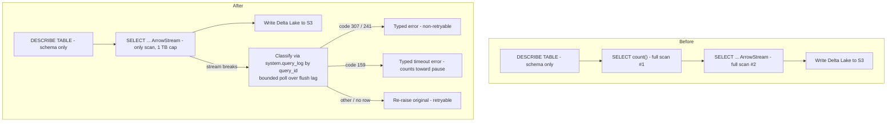
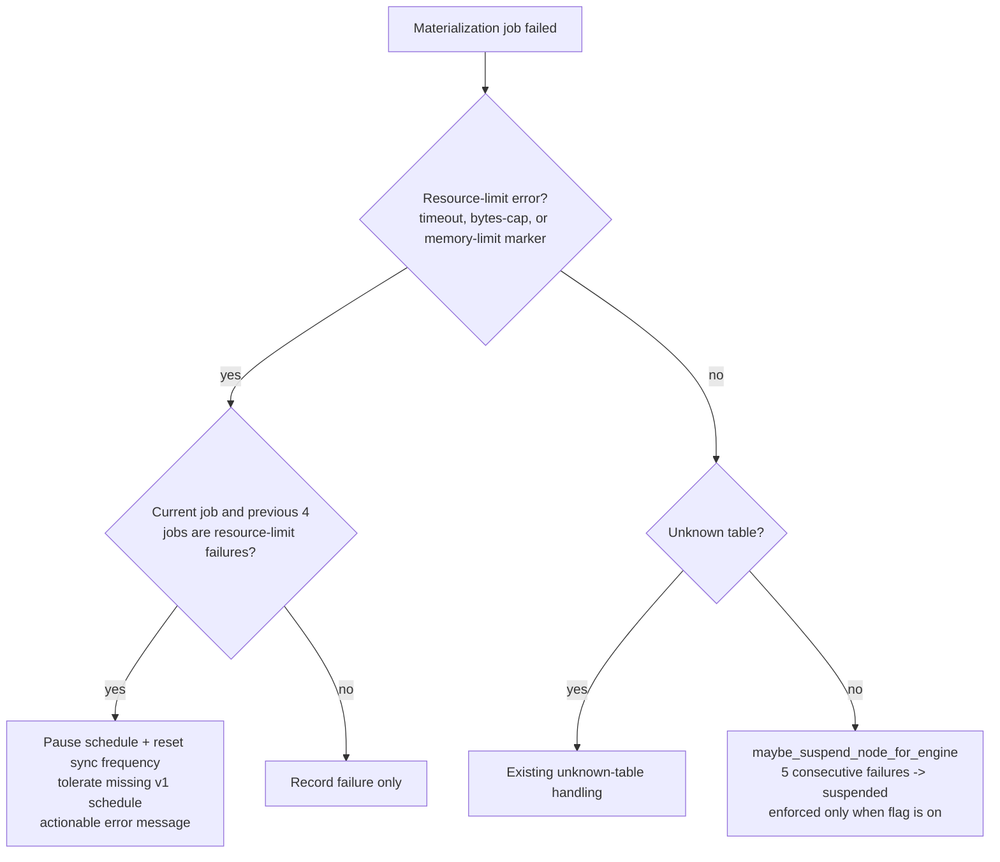

# Data-modeling v2 ClickHouse cost reduction - Plan

## Goal Capsule

- **Objective:** Cut the ClickHouse cost of data-modeling v2 view materialization by removing the duplicate `count()` execution, capping bytes read per query, making resource-limit failures terminal instead of retried, and exposing node suspension so the enforcement flag can be rolled out.
- **Authority:** This plan > repo conventions (`CLAUDE.md`, `posthog/temporal/data_modeling/CLAUDE.md`) > implementer judgment. v1 (`posthog/temporal/data_modeling/run_workflow.py`) is frozen and must not be modified under any circumstances.
- **Stop conditions:** Stop and surface if a change would require editing v1, editing a workflow command sequence (would need `workflow.patched()` per `.claude/rules/temporal-workflow-versioning.md`), or modifying models/serializers under `products/data_warehouse/` (owned by another team, read-only from data_modeling).
- **Execution profile:** Three shallow stacked PRs via Graphite (`gt create` / `gt submit`), U1 first; merge the base before extending if review stalls.
- **Tail ownership:** Rolling out the `data-modeling-suspend-failing-nodes` feature flag is an ops action after PR 3 ships, not part of this plan's diff.

---

## Product Contract

### Summary

A Graphite stack of three v2-only PRs that cuts materialization read bytes by dropping the duplicate `count()` pre-pass, bounds runaway scans (1 TB bytes-read cap, terminal on breach), routes resource-limit failures into the existing schedule-pause/suspension machinery, and surfaces suspension state in the API/UI.

### Problem Frame

Fleet query-cost analysis showed data-modeling materialization is the dominant ClickHouse cost bucket for several customers, with one showing a 54% failure share. The read-bytes-weighted cost model makes scan volume the lever. Investigation found v2 materialization executes every model query twice (a `SELECT count()` pre-pass feeding only a progress bar), applies no bytes/rows cap (only a 600 s wall clock), and retries failing queries up to 3 (activity) × 3 (schedule) times — including memory-limit errors that are meant to be terminal but are matched against a v1-only exception name that never fires in v2. Node suspension after repeated failures exists but is gated behind a feature flag and invisible to users, making rollout risky.

### Requirements

**Query cost**

- R1. A v2 materialization executes its model query exactly once per refresh — no `count()` pre-pass.
- R2. Job progress stays visible through `rows_materialized`; `rows_expected` remains null with the existing UI fallback (Running tag + live rows count) intact.

**Guardrails**

- R3. Every v2 materialization query carries a configurable bytes-read cap — default 1 TB, `0` disables.
- R4. Bytes-cap and memory-limit failures are terminal: Temporal does not retry them at the activity level.

**Failure handling**

- R5. Resource-limit failures (timeout, bytes cap, memory limit) count toward the consecutive-failure schedule pause, and the paused job's error message tells the user to reduce the data the query reads.
- R6. The schedule-pause recovery path works for v2-only saved queries: a missing v1 per-query schedule must not abort the recovery (sync frequency reset and user-facing error prefix still land).

**Visibility**

- R7. Node suspension state — keyed per engine, each entry carrying at least the suspension timestamp and reason — is readable via the nodes API and visible in the data-modeling UI.

### Scope Boundaries

- v1 (`posthog/temporal/data_modeling/run_workflow.py` and its tests) is untouched, including the count-query fix — the migration to v2 is the path to those savings for v1 teams.
- Shared-dashboard query costs (anonymous `sharing_token` force-refresh path) are a separate surface, excluded from this plan.
- No changes to models or serializers under `products/data_warehouse/` — `DataModelingJob.rows_expected` stays in place, nullable.

**Deferred to Follow-Up Work**

- Usage-gated refresh (pause materialization for views nobody queries, following `products/endpoints/backend/tasks/tasks.py` `deactivate_stale_materializations`): needs a `last_queried_at` signal recorded at HogQL resolution, a migration, and a report-only bake period — its own project.
- Incremental materialization / skip-if-source-unchanged: structural, needs design with the data-modeling team.
- Optional progress-bar restoration by seeding `rows_expected` from the previous completed job's `rows_materialized` (one Postgres query, zero ClickHouse cost) — only if the missing bar is missed after U1 ships.
- Stamping `workload` on materialization query tags so cost attribution stops classifying them under the "temporal mislabeled ONLINE" bucket (labeling nit; routing already targets the offline cluster).

---

## Planning Contract

### Key Technical Decisions

- KTD1. **v2 only; v1 stays frozen** (session-settled: user-directed — chosen over a minimal v1 backport of the count-query fix: v1 is frozen per `posthog/temporal/data_modeling/CLAUDE.md` and the migration window should stay small).
- KTD2. **Drop `rows_expected` instead of deriving progress from ClickHouse progress headers.** `astream_query_as_arrow` (`posthog/temporal/common/clickhouse.py`) neither forwards settings nor exposes the response; `X-ClickHouse-Progress` headers stop once the first data block streams; and `total_rows_to_read` counts input rows scanned, which is meaningless as a denominator for aggregating/filtering models. `rows_expected=None` is already a production-exercised state with a working UI fallback.
- KTD3. **Bytes-read cap defaults to 1 TB, env-configurable, `0` disables** (session-settled: user-approved — chosen over 5 TB or opt-in-only: 1 TB matches the FULL emergency kill-switch level in `posthog/clickhouse/client/execute.py`, and unattended background load that retries should be at least as strict as the emergency setting). Env-only: no per-team override infrastructure exists (`get_default_hogql_global_settings` is a stub that ignores `team_id`).
- KTD4. **Classify stream failures post-hoc via `system.query_log` lookup, keyed on a `query_id` minted in `hogql_table`.** With the count pre-pass gone there is no early typed-error gate: a cap breach mid-ArrowStream surfaces as a broken stream or `pa.ipc` parse error, not the typed exception `raise_clickhouse_error` produces on non-200 responses. The query-log lookup (precedent: `aget_written_rows_from_query_log` in `posthog/temporal/common/clickhouse.py`) maps exception code 307 (`TOO_MANY_BYTES`), 241 (memory limit), and 159 (timeout) to the typed errors; anything else re-raises the original. Because query-log rows flush asynchronously (~7.5 s default), the lookup polls with a short bounded retry before falling back — seconds against an already-failed activity, versus terabyte-scale retry reads if a cap breach stays untyped and retryable. Rejected: `wait_end_of_query=1` buffering (non-starter for arbitrary-size streams).
- KTD5. **Fix the latent non-retryable mismatch while adding the cap.** `NON_RETRYABLE_ERRORS` in `posthog/temporal/data_modeling/workflows/materialize_view.py` lists `CHQueryErrorMemoryLimitExceeded` — a class defined only in frozen v1. The v2 client raises `ClickHouseMemoryLimitExceededError`, so memory-limit failures are retried 3× today. Editing the `RetryPolicy` argument changes activity options, not the workflow command sequence — no `workflow.patched()` needed.
- KTD6. **Generalize the existing timeout-pause streak to "resource-limit" errors** rather than adding a parallel mechanism — one predicate over the error string dispatches both timeout and bytes-cap markers, so mixed streaks pause too.
- KTD7. **Suspension enforcement rollout is ops; this plan only adds visibility** (session-settled: user-approved — chosen over a code-minimal stack with ops-only rollout: users need to see why a node stopped running before the flag is enabled broadly).
- KTD8. **Three stacked PRs via Graphite** (session-settled: user-directed — user preference for stacking; keeps each diff reviewable and lets the high-value count-fix merge first).

### High-Level Technical Design

Materialization query flow, before and after U1–U3:



Failure handling after U4 (dispatch in `fail_materialization_activity`):



### Sequencing

- **PR 1** (U1) — count-query removal. Largest win, smallest diff, no dependencies.
- **PR 2** (U2, U3, U4) — cap, classification, failure handling. Stacked on PR 1 because U3's classifier exists precisely because U1 removed the early gate.
- **PR 3** (U5, U6) — suspension visibility. Independent of PRs 1–2 in code terms but stacked to keep one linear Graphite stack; it can be submitted off-stack instead if the suspension-flag rollout shouldn't wait on PR 1–2 review.

---

## Implementation Units

### U1. Remove the duplicate count() execution

- **Goal:** v2 materialization runs the model query once; `rows_expected` is never set.
- **Requirements:** R1, R2
- **Dependencies:** none
- **Files:** `posthog/temporal/data_modeling/activities/materialize_view.py`, `posthog/temporal/tests/data_modeling/test_materialize_view_activities.py`
- **Approach:** Delete `get_query_row_count` (v2-private; v1 has its own copy with no cross-imports) and its try/except call site in `materialize_view_activity`; delete the now-dead expected-vs-actual mismatch warning. Capture the schema from the initial Arrow stream before consuming batches, so the zero-row path can write its queryable empty result without reissuing the model query. No model, serializer, facade, or frontend changes: `rows_expected` is nullable end-to-end and `MaterializationStatusPanel.tsx` already renders the null state (Running tag + live `rows_materialized`).
- **Execution note:** Invoke `/writing-tests` before touching the test file. Verify with the linter that no imports become unused (everything the deleted function used is still used by `hogql_table`).
- **Test scenarios:**
  - Remove the six `patch(...get_query_row_count)` context managers in the existing activity tests (they raise `AttributeError` once the function is gone).
  - The job-progress test asserts `rows_expected is None` after a successful materialization (pins the new contract) and `rows_materialized` still reflects rows written.
  - Zero-row materialization still writes the empty parquet and completes.
- **Verification:** `hogli test posthog/temporal/tests/data_modeling/test_materialize_view_activities.py` green; `grep -rn get_query_row_count posthog products` leaves only the v1 definition/call and v1 tests; a local dev-stack materialization shows exactly one execution of the model query in `system.query_log` and the UI panel shows the Running tag with a live rows count.

### U2. Bytes-read cap on materialization queries

- **Goal:** Every v2 materialization query carries `max_bytes_to_read` (default 1 TB) with `read_overflow_mode="throw"`.
- **Requirements:** R3
- **Dependencies:** U1 (same file; avoids conflicting edits to the settings block)
- **Files:** `posthog/settings/data_warehouse.py`, `posthog/temporal/data_modeling/activities/materialize_view.py`, `posthog/temporal/tests/data_modeling/test_materialize_view_activities.py`
- **Approach:** New Django setting `DATA_MODELING_MATERIALIZATION_MAX_BYTES_TO_READ` (int, default 1 TB, `0` disables), following the `get_from_env` pattern. Extract a `_materialization_query_settings()` helper for the settings setup in `hogql_table` (the only settings block left after U1); when the cap is non-zero, set `max_bytes_to_read` and `read_overflow_mode="throw"` — both existing `HogQLQuerySettings` fields the printer emits in the SETTINGS clause, mirroring the logs-user cap in `posthog/hogql/query.py`.
- **Technical design (directional):** watch the local-name shadowing — these functions rebind `settings` to `HogQLGlobalSettings`; read the Django setting via a module-level alias before the rebind.
- **Test scenarios:**
  - Default: helper returns settings with `max_bytes_to_read` = 1 TB and `read_overflow_mode="throw"`.
  - `override_settings(DATA_MODELING_MATERIALIZATION_MAX_BYTES_TO_READ=0)`: neither field set.
  - The printed materialization SQL contains the cap in its SETTINGS clause (guards against the helper being bypassed).
- **Verification:** unit tests green; locally, a tiny cap value makes a view over `events` fail with a `TOO_MANY_BYTES` error visible in the job error.

### U3. Typed classification of stream failures + correct non-retryable list

- **Goal:** Cap and memory-limit breaches surface as typed exceptions and are never retried by the activity.
- **Requirements:** R4
- **Dependencies:** U2
- **Files:** `posthog/temporal/data_modeling/activities/materialize_view.py`, `posthog/temporal/data_modeling/workflows/materialize_view.py`, `posthog/temporal/tests/data_modeling/test_materialize_view_activities.py`
- **Approach:** `hogql_table` mints a `query_id` (uuid4) and passes it to `astream_query_as_arrow`; stream/parse failures are classified inside `hogql_table`'s exception handler, where both the `query_id` and the open client are in scope, and the typed error propagates out of the generator to the activity. Classification: look up the query's exception code in `system.query_log` with four attempts over the query-log flush window. Each keyed metadata lookup has an explicit two-second timeout, so an unavailable query log is treated as unattributable rather than holding a ClickHouse semaphore permit until the activity deadline. Re-raise `ClickHouseTooManyBytesError` for code 307, `ClickHouseMemoryLimitExceededError` for code 241, and `ClickHouseQueryTimeoutError` for code 159 (all already defined in `posthog/temporal/common/clickhouse.py` — 159 makes mid-stream server timeouts carry the timeout marker U4 matches on). If no row appears or a lookup fails after the bounded poll, re-raise the original error. In `NON_RETRYABLE_ERRORS`, add `ClickHouseTooManyBytesError` and `ClickHouseMemoryLimitExceededError`; delete the inert v1-only `CHQueryErrorMemoryLimitExceeded` entry. This edits `RetryPolicy` options only — not the workflow command sequence — so no `workflow.patched()` gating.
- **Test scenarios:**
  - Stream failure + query-log row with code 307 → `ClickHouseTooManyBytesError` raised.
  - Stream failure + code 241 → `ClickHouseMemoryLimitExceededError` raised.
  - Stream failure + code 159 → `ClickHouseQueryTimeoutError` raised.
  - Stream failure + unrelated code, or no query-log row after the bounded poll → original exception propagates unchanged.
  - A hanging query-log lookup returns control within the per-attempt timeout and ultimately re-raises the original stream error.
  - Regression pin: `NON_RETRYABLE_ERRORS` contains both new names and not the stale v1 name.
- **Verification:** unit tests green; in the local Temporal UI, a cap-breaching run fails on the first attempt with no activity retries.

### U4. Resource-limit failures count toward schedule pause; v2 pause-path fix

- **Goal:** Five consecutive over-budget failures pause the schedule exactly like timeouts, with an actionable message, and the recovery path works for v2-only saved queries.
- **Requirements:** R5, R6
- **Dependencies:** U3 (error strings now carry the typed markers)
- **Files:** `posthog/temporal/data_modeling/activities/fail_materialization.py`, `posthog/temporal/tests/data_modeling/test_materialize_view_activities.py` (or the existing fail-materialization test module)
- **Approach:** Introduce a `_is_resource_limit_error(error)` predicate over the markers (timeout strings, `TOO_MANY_BYTES` / "Limit for bytes to read exceeded", `MEMORY_LIMIT_EXCEEDED` / "Memory limit"); use it in the v2-only resource-limit streak check and in the dispatch branch of `fail_materialization_activity`, so mixed timeout/cap/memory streaks pause too. The check counts the current failed job plus four prior matching failures; leave the frozen v1 timeout helper unchanged. Update the paused-job message to say the query reads too much data and suggest narrowing it. Wrap `pause_saved_query_schedule` in a `try/except RPCError` tolerating NOT_FOUND so v2-only saved queries (no v1 per-query schedule) still get `sync_frequency_interval=None` and the user-facing error prefix. The error string reaching the activity is `str(ActivityError.cause)` and contains the full ClickHouse message including `(TOO_MANY_BYTES)`, so substring dispatch works unchanged.
- **Test scenarios:**
  - Parametrize the existing consecutive-failure pause tests over error strings: all-timeout, all-bytes-cap, all-memory-limit, mixed → schedule paused; fewer than 5, or a success in the window → not paused.
  - Paused-job error message mentions reducing the data read for bytes-cap streaks.
  - Recovery with no v1 schedule present (RPCError NOT_FOUND) still resets sync frequency and applies the error prefix.
- **Verification:** unit tests green; the streak behavior observed locally by forcing repeated cap failures on a scheduled view.

### U5. Expose node suspension in the nodes API

- **Goal:** Suspension state (per engine: at, reason, job id) is readable from the nodes endpoint.
- **Requirements:** R7
- **Dependencies:** none (stacked after U4 for Graphite linearity)
- **Files:** `products/data_modeling/backend/presentation/views/node.py`, its test module, regenerated types via `hogli build:openapi`
- **Approach:** Read-only `suspended` `SerializerMethodField` on `NodeSerializer` returning the engine-keyed dict from `properties["system"]["suspended"]` — each structured entry carries the suspension timestamp, reason, and job id, matching what `maybe_suspend_node_for_engine` writes — or null when absent, alongside the existing `last_run_status`/`last_run_at` fields it already derives from `properties.system`. Normalize legacy truthy boolean engine values to the same structured shape with nullable `at`, `reason`, and `job_id`, because those details cannot be reconstructed. U6's tooltip consumes the timestamp and reason when available, so nullable fields are the serializer's contract, not incidental payload. Annotate with `help_text` so the generated schema is meaningful.
- **Execution note:** Invoke `/improving-drf-endpoints` before editing the serializer; run `hogli build:openapi` after.
- **Test scenarios:**
  - Node with `properties.system.suspended` set → field returned with engine keys, each entry exposing timestamp and reason.
  - Node with legacy `properties.system.suspended = {engine: true}` → field returned with nullable details.
  - Node without suspension → field is null/absent-consistent with serializer convention.
- **Verification:** API test green; generated types include the field; OpenAPI schema check passes in preflight.

### U6. Suspension badge in the data-modeling UI

- **Goal:** A suspended node is visibly flagged where its run status is shown, with the reason available on hover.
- **Requirements:** R7
- **Dependencies:** U5
- **Files:** the data-modeling frontend component rendering node `last_run_status` (locate under `products/data_modeling/frontend/` or `frontend/src/scenes/data-warehouse/`), plus its logic file if state handling is needed
- **Approach:** Render a warning `LemonTag` (matching the surrounding scene's existing status tags) when `suspended` is non-null, with a tooltip carrying the reason and time when available. Render `Suspended (details unavailable)` for a normalized legacy entry. Use the generated API type for the new field — no handwritten interface. Business logic, if any, goes in the kea logic file, not hooks.
- **Execution note:** Invoke `/adopting-generated-api-types` if the file touches API types; follow `frontend/src/AGENTS.md`.
- **Test scenarios:** A focused rendering assertion covers both the detailed tooltip and the legacy-details-unavailable tooltip.
- **Verification:** `pnpm --filter=@posthog/frontend typescript:check` passes; badge confirmed in the browser against a locally suspended node (set `properties.system.suspended` directly).

---

## Verification Contract

| Gate                    | Command                                             | Applies to       |
| ----------------------- | --------------------------------------------------- | ---------------- |
| Activity/workflow tests | `hogli test posthog/temporal/tests/data_modeling/`  | U1–U4            |
| API tests               | `hogli test products/data_modeling/backend/`        | U5               |
| Python lint             | `ruff check . --fix && ruff format .`               | all Python units |
| TypeScript check        | `pnpm --filter=@posthog/frontend typescript:check`  | U6               |
| OpenAPI regen           | `hogli build:openapi` (commit regenerated files)    | U5               |
| Pre-push                | `hogli ci:preflight --fix` before every `gt submit` | all PRs          |

End-to-end proof (local dev stack, per PR):

1. PR 1: trigger a saved-query materialization; `system.query_log` shows one execution of the model query (no `SELECT count()` pre-pass); job completes with `rows_materialized` set, `rows_expected` null; UI shows Running tag + rows count.
2. PR 2: set the cap env var to a tiny value; a view over `events` fails fast with the typed error, no activity retries in the Temporal UI; five consecutive failures pause the schedule with the actionable message.
3. PR 3: a node with suspension state set shows the badge and the API returns the field.

Fleet checks (ops):

- Pre-deploy, before PR 1 ships: measure the `count()` pre-pass's actual share of materialization read bytes from `system.query_log` (pre-pass queries are identifiable by their `SELECT count() FROM (` shape) — that measured share, not an assumed 50%, is the post-deploy savings target. ClickHouse prunes unused columns under a bare `count()`, so the pre-pass can read fewer bytes than the full-column scan.
- Pre-deploy, before PR 2 ships: count currently-succeeding materialization runs with `read_bytes` > 1 TB over the last 30 days and include the result in PR 2's ops handoff — a nonzero count means the cap will convert working views into terminal failures and needs targeted comms first.
- Post-deploy: re-run the query-cost analysis (`analyzing-query-costs` skill, daily-trend query, data-modeling bucket) and confirm materialization read bytes drop by the measured pre-pass share.

---

## Definition of Done

- All six units land as three merged PRs in the Graphite stack, each with conventional-commit titles (`fix(data-modeling): ...` / `feat(data-modeling): ...`).
- All Verification Contract gates green per PR; no `--no-verify` pushes.
- No diffs under `posthog/temporal/data_modeling/run_workflow.py`, v1 tests, or `products/data_warehouse/` models/serializers.
- `grep` confirms no v2 references to `get_query_row_count` or the stale `CHQueryErrorMemoryLimitExceeded` entry remain.
- No abandoned experiment code in the final diffs; superseded test patches removed, not skipped.
- The suspension-flag rollout note is handed to ops (PR 3 description), not silently dropped.

## Local Verification Note

In workspaces where `hogli` is not on `PATH`, run focused Python coverage through the activated environment:

```bash
flox activate -- bash -c '.venv/bin/python -m pytest posthog/temporal/tests/common/test_asyncpa.py posthog/temporal/tests/data_modeling/test_materialize_view_helpers.py posthog/temporal/tests/data_modeling/test_materialize_view_activities.py products/data_modeling/backend/tests/api/test_node_api.py -q'
```

Run the focused suspension-tooltip rendering test with:

```bash
flox activate -- bash -c 'pnpm --dir frontend exec jest --runInBand products/data_modeling/frontend/lineage/LineageNode.test.tsx'
```

Regenerate the schema-derived API types with:

```bash
flox activate -- bash -c './bin/hogli build:openapi'
```
